# AI-Powered Task Management Portal

## Overview

AI-Powered Task Management Portal is a full-stack web application that enables users to create, manage, and track tasks efficiently. The application includes secure JWT-based authentication, task lifecycle management, and AI-powered task generation using Google Gemini AI. Users can organize their work, prioritize tasks, monitor progress, and leverage AI assistance to automatically generate task descriptions, priorities, and estimated effort.

---

## Tech Stack

### Backend
- Java 17
- Spring Boot
- Spring Security
- JWT Authentication
- Spring Data JPA
- Hibernate
- MySQL
- Maven

### Frontend
- React
- Vite
- Tailwind CSS
- Axios
- React Router DOM
- Lucide React Icons

### AI Integration
- Google Gemini API

---

## Project Structure

```text
AI-task-manager-project/
│
├── ai-task-manager/                    # Spring Boot Backend
│   ├── src/
│   │   ├── main/
│   │   │   ├── java/
│   │   │   │   └── com.taskportal/
│   │   │   │       ├── config/
│   │   │   │       ├── controller/
│   │   │   │       ├── dto/
│   │   │   │       ├── entity/
│   │   │   │       ├── exception/
│   │   │   │       ├── repository/
│   │   │   │       ├── security/
│   │   │   │       ├── service/
│   │   │   │       ├── serviceimpl/
│   │   │   │       └── util/
│   │   │   └── resources/
│   │   │       └── application.properties
│   │   └── test/
│   └── pom.xml
│
├── AI-Task-Manager-Frontend/           # React Frontend
│   ├── src/
│   │   ├── components/
│   │   ├── context/
│   │   ├── pages/
│   │   ├── services/
│   │   ├── App.css
│   │   ├── App.jsx
│   │   ├── index.css
│   │   └── main.jsx
│   ├── public/
│   ├── package.json
│   └── vite.config.js
│
├── screenshots/                        # Application Screenshots
├── diagrams/                           # ER & Architecture Diagrams
└── README.md
```

---

## Architecture Overview

```text
Frontend (React + Vite + Tailwind CSS)
                |
                v
        Axios REST Calls
                |
                v
     Spring Boot REST APIs
                |
                v
    Spring Security + JWT
                |
                v
          Service Layer
                |
                v
        Repository Layer
                |
                v
             MySQL

AI Flow:

React UI
   |
   v
AI Task Request
   |
   v
Spring Boot AI Service
   |
   v
Google Gemini API
   |
   v
Generated Task Details
   |
   v
React Dashboard
```

---

## Features

### Authentication Module
- User Registration
- User Login
- JWT Token Generation
- Protected APIs
- Password Encryption using BCrypt

### Task Management Module
- Create Tasks
- View Tasks
- Edit Tasks
- Delete Tasks
- Update Task Status
  - TODO
  - IN_PROGRESS
  - DONE
- Task Priority Management
  - LOW
  - MEDIUM
  - HIGH
- Due Date Tracking
- Created Timestamp Tracking

### AI Task Assistant
Generate task details using AI:

Input:
- Task Title

Output:
- Task Description
- Suggested Priority
- Estimated Completion Time

Example:

Input:
```text
Prepare client presentation
```

Output:
```text
Description:
Prepare presentation slides for client meeting.

Priority:
HIGH

Estimated Time:
4 Hours
```

### AI Failure Handling
If Gemini API is unavailable, the application returns a fallback response instead of crashing.

---

## Security Features

- JWT Authentication
- Protected Endpoints
- BCrypt Password Hashing
- Environment Variable Support
- User-Specific Task Access
- Input Validation
- Global Exception Handling

---

## Database Schema

### User

| Field | Type |
|---------|---------|
| id | Long |
| name | String |
| email | String |
| password | String |
| createdAt | LocalDateTime |

### Task

| Field | Type |
|---------|---------|
| id | Long |
| title | String |
| description | String |
| priority | Enum |
| status | Enum |
| dueDate | LocalDate |
| estimatedHours | String |
| createdAt | LocalDateTime |
| user | ManyToOne |

Relationship:

```text
User (1)
   |
   |----< Task (Many)
```

---

## API Endpoints

### Authentication

#### Register User

```http
POST /api/auth/register
```

Request:

```json
{
  "name": "Arpitha",
  "email": "arpitha@gmail.com",
  "password": "Password@123"
}
```

#### Login User

```http
POST /api/auth/login
```

Request:

```json
{
  "email": "arpitha@gmail.com",
  "password": "Password@123"
}
```

---

### Tasks

#### Create Task

```http
POST /api/tasks
```

#### Get All Tasks

```http
GET /api/tasks
```

#### Update Task

```http
PUT /api/tasks/{id}
```

#### Update Task Status

```http
PATCH /api/tasks/{id}/status
```

#### Delete Task

```http
DELETE /api/tasks/{id}
```

---

### AI Assistant

#### Generate Task Using AI

```http
POST /api/ai/generate
```

Request:

```json
{
  "title": "Prepare Java Interview"
}
```

---

# Setup Instructions

## Prerequisites

Install the following software before running the project:

- Java 17
- Eclipse IDE (for Spring Boot Backend)
- Visual Studio Code (for React Frontend)
- MySQL Server
- Maven
- Node.js and npm
- Google Gemini API Key

---

## Backend Setup (Spring Boot)

### 1. Clone the Repository

```bash
git clone <repository-url>
```

### 2. Open Backend in Eclipse

- Open Eclipse IDE
- Select **File → Import**
- Choose **Existing Maven Projects**
- Browse to:

```text
AI-task-manager-project/ai-task-manager
```

- Click **Finish**
- Wait for Maven dependencies to download

### 3. Create MySQL Database

```sql
CREATE DATABASE task_manager_db;
```

### 4. Configure Environment Variables

Set the following environment variables:

```text
DB_URL
DB_USERNAME
DB_PASSWORD
JWT_SECRET
JWT_EXPIRATION
GEMINI_API_KEY
```

### 5. Update application.properties (if required)

```properties
spring.datasource.url=${DB_URL}
spring.datasource.username=${DB_USERNAME}
spring.datasource.password=${DB_PASSWORD}

jwt.secret=${JWT_SECRET}
jwt.expiration=${JWT_EXPIRATION}
```

### 6. Run Spring Boot Application

Run:

```text
AiTaskManagerApplication.java
```

or

```bash
mvn spring-boot:run
```

Backend URL:

```text
http://localhost:8080
```

---

## Frontend Setup (React + Vite)

### 1. Open Frontend in VS Code

Open:

```text
AI-task-manager-project/AI-Task-Manager-Frontend
```

### 2. Install Dependencies

```bash
npm install
```

### 3. Start Frontend Application

```bash
npm run dev
```

Frontend URL:

```text
http://localhost:5173
```

---

## Database

Database Used:

```text
MySQL
```

Database Name:

```text
task_manager_db
```

---

## AI Configuration

AI Service:

```text
Google Gemini API
```

Required Environment Variable:

```text
GEMINI_API_KEY
```

The backend securely reads the API key from environment variables and communicates with Google Gemini to generate task descriptions, priorities, and estimated effort.

---

## Validation

### Registration Validation

Password must contain:
- Minimum 8 characters
- One uppercase letter
- One lowercase letter
- One number
- One special character

### Task Validation

- Title cannot be blank

---

## Screenshots

### Login Page
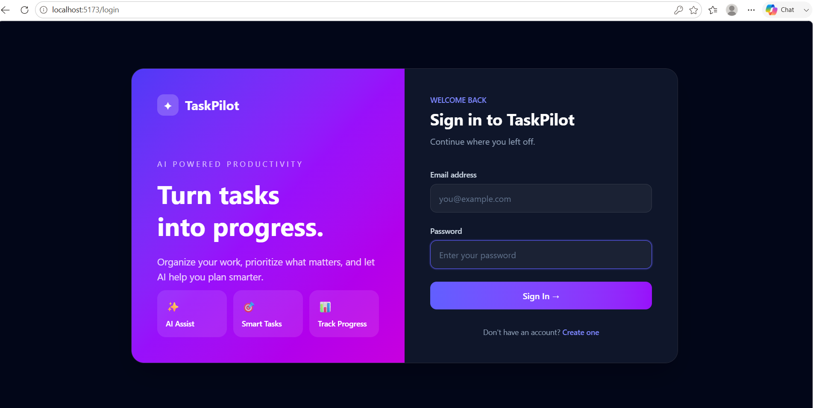

### Registration Page
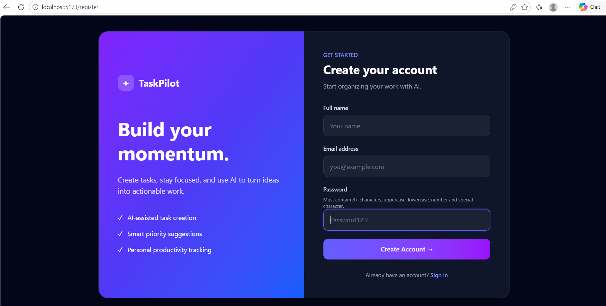

### Dashboard
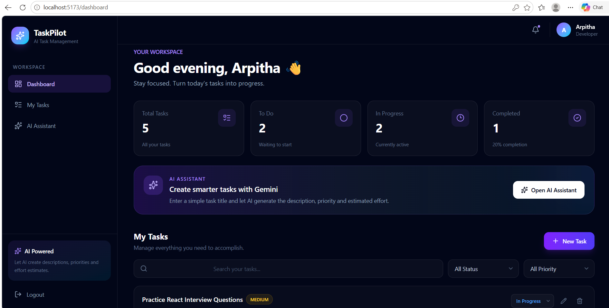

### Create Task
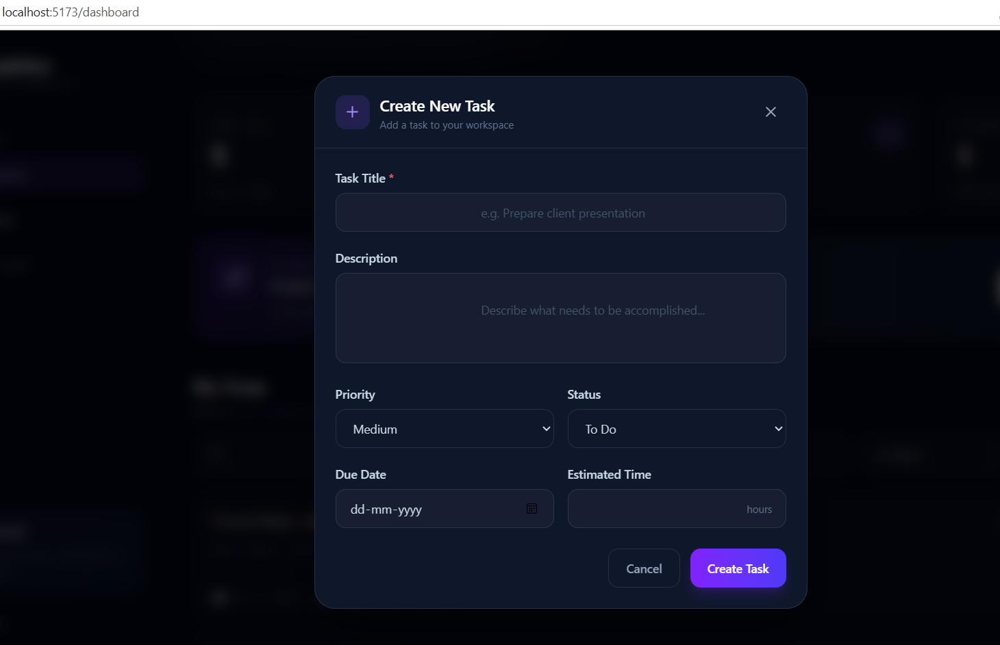

### AI Assistant
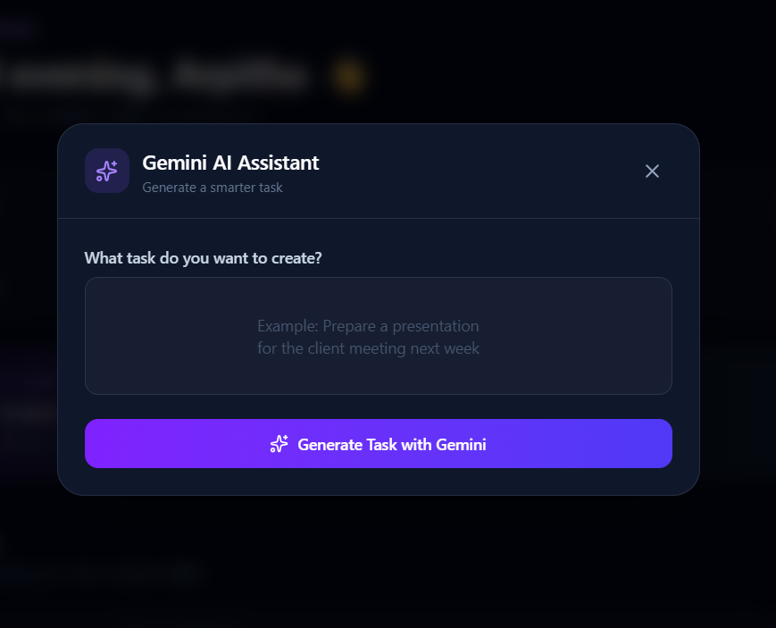

### AI Generated Task
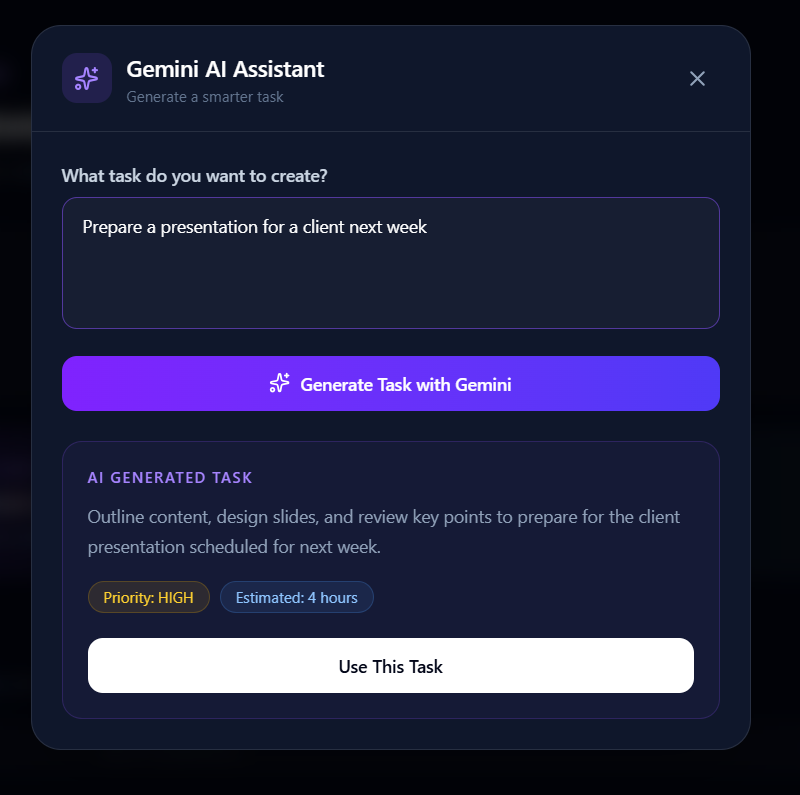

### Task Status Update
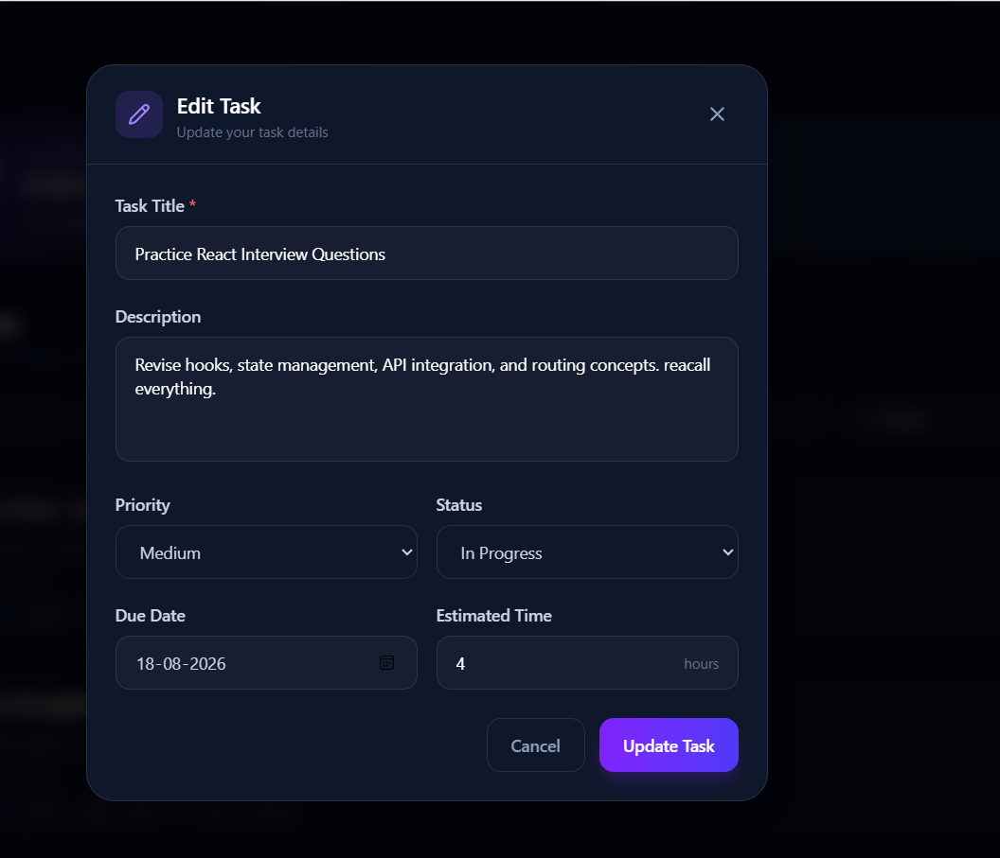

### My Task
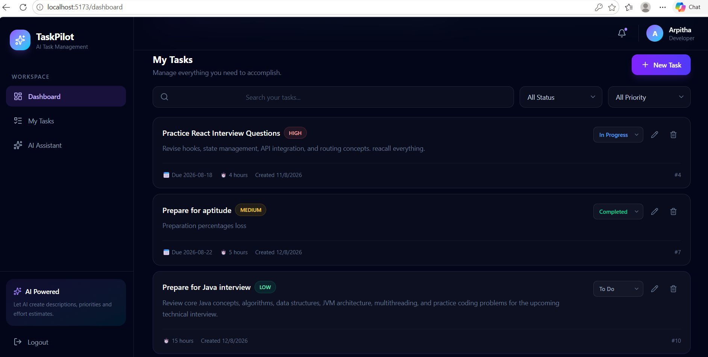

---

## Database Schema

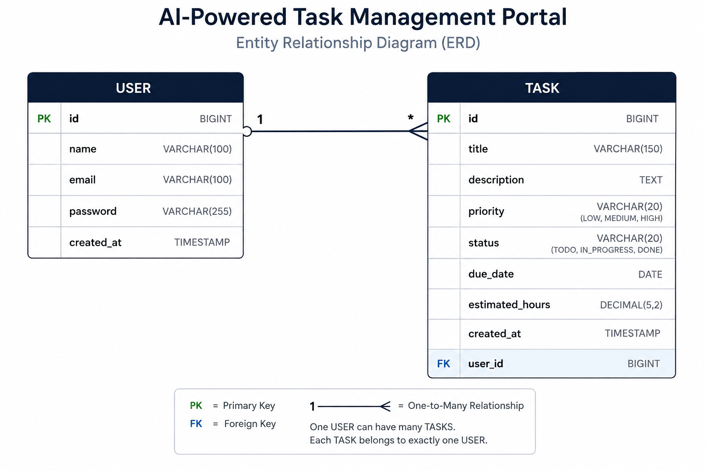

## Architecture Diagram

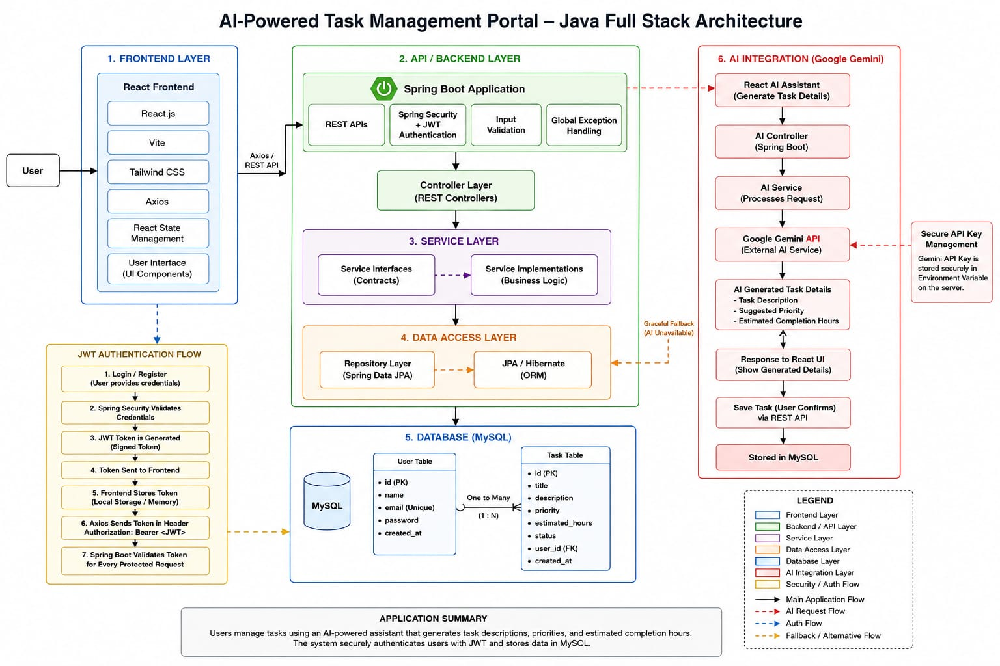

## Database Implementation

The database schema was implemented using MySQL.

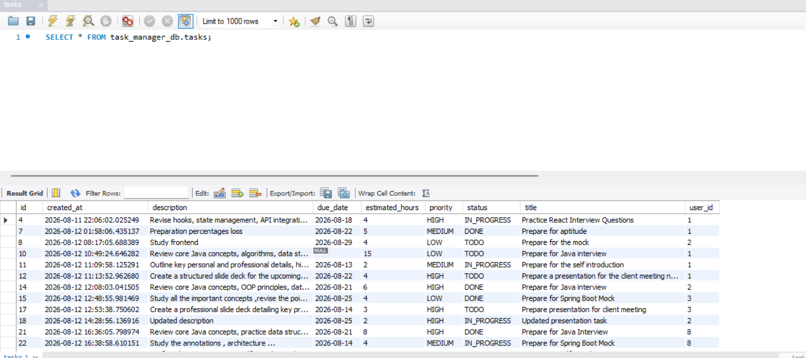

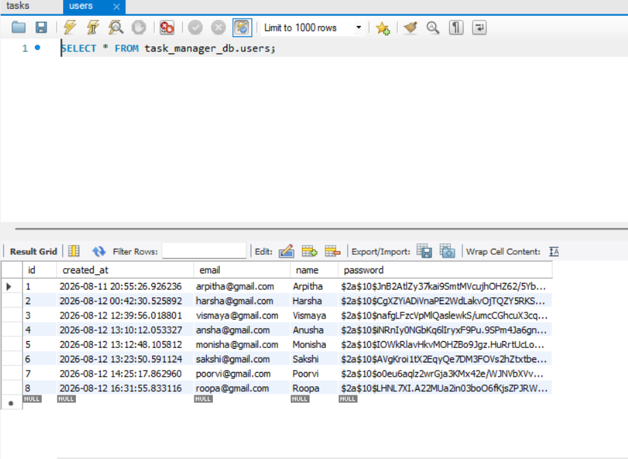

## Application Flow

### Authentication Flow

User
   ↓
React Login/Register
   ↓
Spring Boot Authentication API
   ↓
BCrypt Password Verification
   ↓
JWT Token Generated
↓
JWT Token Stored in Browser Local Storage
↓
JWT Attached to Protected API Requests

### Task Flow

User
   ↓
React Dashboard
   ↓
Axios REST API
   ↓
JWT Authentication
   ↓
Task Controller
   ↓
Task Service
   ↓
Task Repository
   ↓
MySQL

### AI Task Generation Flow

User enters task title
   ↓
React AI Assistant
   ↓
Axios
   ↓
Spring Boot AI Controller
   ↓
AI Service
   ↓
Google Gemini API
   ↓
Description + Priority + Estimated Hours
   ↓
React Dashboard
   ↓
User confirms task
   ↓
Task saved to MySQL

## Challenges Faced

- Implementing JWT Authentication
- Securing AI Endpoints
- Integrating Google Gemini API
- Managing User-Specific Task Access
- Handling Validation and Exceptions
- Connecting Frontend and Backend APIs

---

## Assumptions

- Each registered user can access and manage only their own tasks.
- JWT authentication is required for protected task and AI APIs.
- MySQL is used as the relational database.
- Google Gemini API is used for AI-powered task generation.
- AI-generated task details are suggestions and can be modified by the user before saving.
- Blockchain integration was treated as an optional bonus feature and was not implemented because the mandatory requirements were prioritized.

---

## Future Enhancements

- Role-Based Access Control
- Pagination
- Search and Filtering
- Task Analytics Dashboard
- Docker Deployment
- Cloud Deployment
- Unit Testing
- Blockchain Audit Trail

---

## Author

Arpitha C

Java Full Stack Developer Intern Assignment
AI-Powered Task Management Portal
